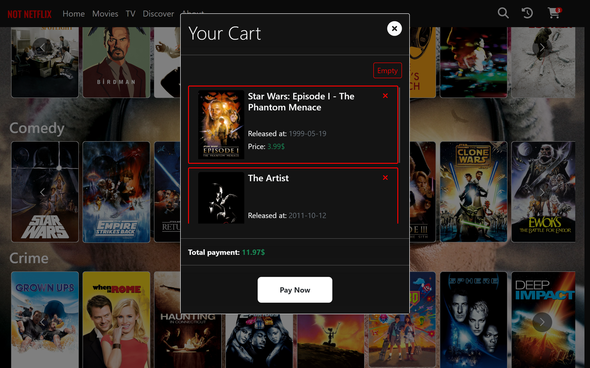

# NOT- Netflix

## Description

is an engaging web application designed in the spirit of Netflix. It was built using React and uses the TheMovieDB API.
Users can navigate through a wide variety of movies, add them to their cart, and simulate a purchase. Customized views
and user-friendly interfaces make this app an excellent tool for movie enthusiasts who enjoy the process of exploring,
selecting, and purchasing movies in a simulated environment.

This application also using a client-server architecture. The server is built using Spring Boot and the client is built
using React.

## Installation

To install the application, follow the instructions below:

1. Clone the repo to your local machine.
2. Make sure you have db named "not_netflix" in your MySQL Workbench. (you can change it from application.properties)
3. Run the application using `mvn spring-boot:run` command.
4. This will start the server on `localhost:8080`.
5. Now, navigate to the client folder and run `npm install` to install all the dependencies.
6. Run `npm start` to start the client on `localhost:3000`.
7. Enjoy!

## Screenshots

## Technologies Used

- React
- Spring Boot
- MySQL
- TheMovieDB API
- Bootstrap

## License

MIT License